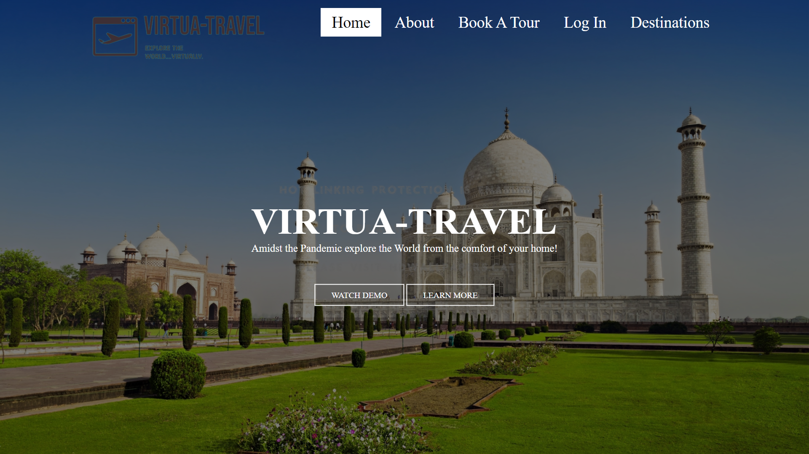
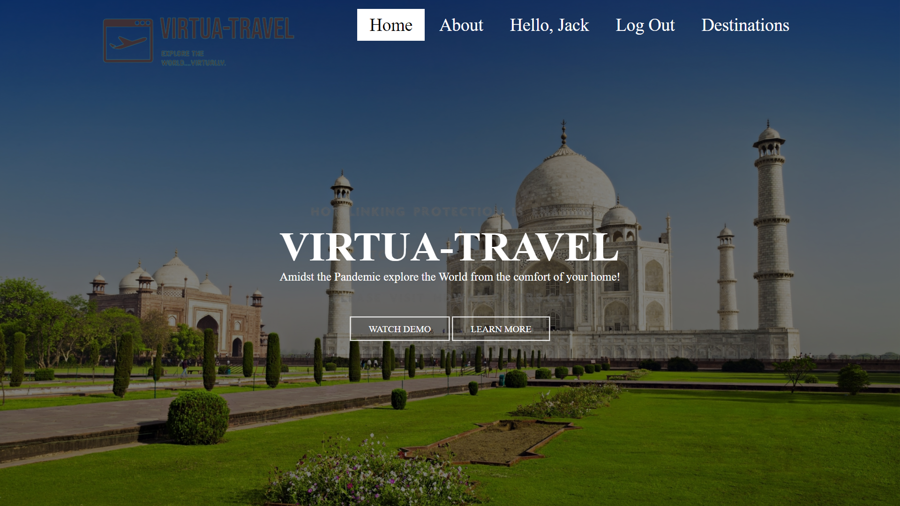
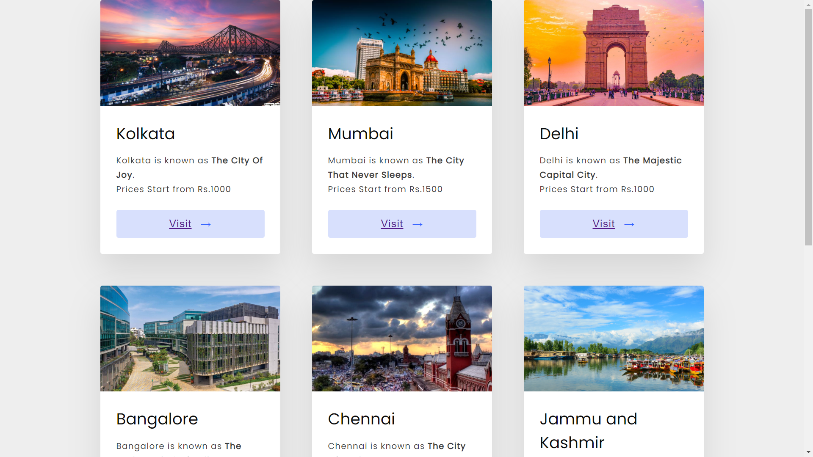
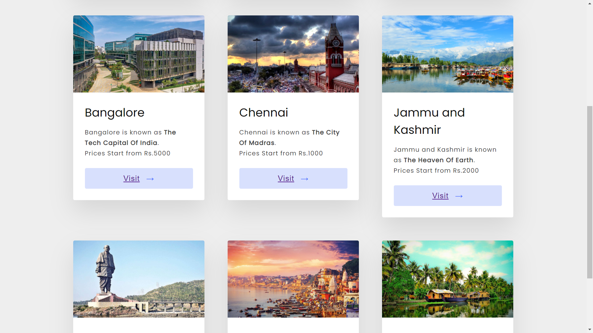
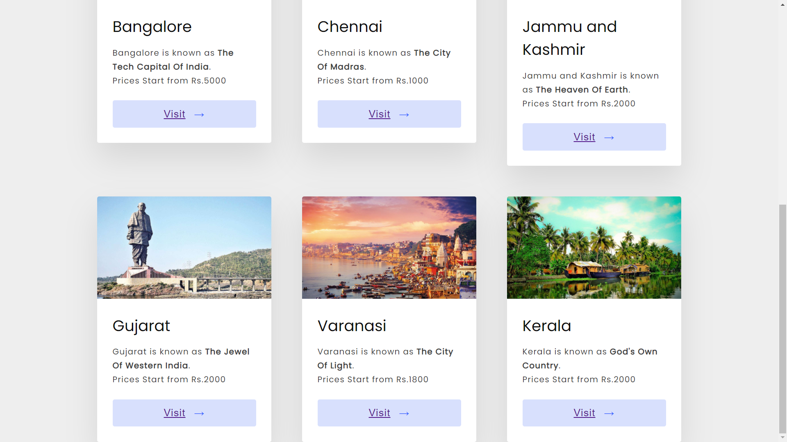
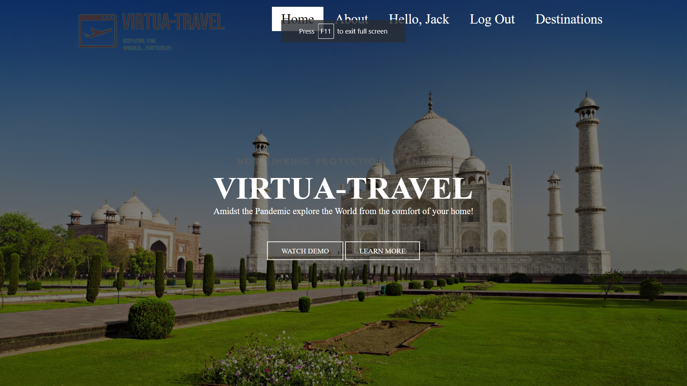

# Virtua-Travel
 A virtual tour/travel booking website built using **HTML** and Materialize **CSS** for **frontend** and the **backend** is built using **Python** and **Django**.
 By authentication the user can register and then Log in to get the trip details and book a virtual tour for the place the want to visit virtually.
 The admin can add destinations and other additional details through admin panel.
 The data is stored using **PostgreSQL** and managed using **PgAdmin**.

## Screens

- Home

- Book A Tour - User Registration

- User Login (After successful registration)

- After Log In, User can view destinations to select or Log Out

- Destinations Added By Admin

- After User Log Out

**Thank You.**
